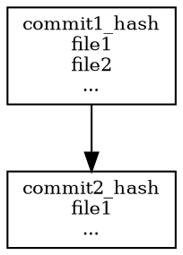

# Визуализатор графа зависимостей Git-репозитория

Этот инструмент позволяет визуализировать граф зависимости коммитов в Git-репозитории, затрагивающих определенный файл. Генерируется код для Graphviz, который можно использовать для построения графов.

---

## Возможности

- Извлечение коммитов, изменяющих указанный файл в Git-репозитории.
- Построение графа зависимостей между коммитами.
- Генерация кода в формате Graphviz для визуализации.
- Ограничение отображаемых файлов в узлах графа для читаемости.

---

## Требования

- Python 3.6 или выше.
- Установленный и доступный из командной строки Git.
- Установленный Graphviz для дальнейшей визуализации графов.

---

## Установка и запуск

1. Сохраните скрипт в файл, например, `git_graphviz.py`.

2. Убедитесь, что Graphviz установлен, и путь к его исполняемому файлу доступен.

3. Запустите скрипт, указав следующие параметры:

```bash
python git_graphviz.py -g <путь_к_исполняемому_файлу_graphviz> -r <путь_к_git_репозиторию> -o <файл_результата> -f <цель_файл>
```
Примеры использования
Пример 1: Генерация графа для файла
```bash
python git_dependency_visualizer.py -r C:\Users\redmi\Documents\Config\Config--Yura\Config--2 -f target_file.txt -o output.dot
```
dot — путь к программе Graphviz.
/path/to/repo — путь к Git-репозиторию.
output.dot — файл, куда будет сохранен код Graphviz.
target_file.txt — файл, для которого анализируются коммиты.
Результат
Файл output.dot: Содержит сгенерированный код Graphviz.
Пример Graphviz кода:

Этот код можно визуализировать с помощью программы Graphviz.

Основные функции
1. Извлечение коммитов (get_commits_with_file)
Находит все коммиты, которые изменяли указанный файл.

2. Построение графа (build_dependency_graph)
Создает зависимости между коммитами (родительские коммиты и измененные файлы).

3. Генерация Graphviz кода (generate_graphviz)
Создает описание графа в формате Graphviz.

Обработка ошибок
Ошибки пути:

Если путь к Graphviz недействителен или недоступен, программа завершится с сообщением об ошибке.
Если путь к репозиторию неверен или не содержит .git, будет выведена ошибка.
Отсутствие коммитов:

Если файл не был найден в истории коммитов, программа завершится с соответствующим сообщением.
Ошибки записи:

При невозможности записать файл программа сообщит об этом и завершится.
Заметки
Ограничение файлов в узлах:

Для улучшения читаемости в узле отображается не более 10 файлов, связанные с коммитом. Остальные заменяются на ....
Совместимость:

Инструмент использует стандартные вызовы Git и работает с любыми репозиториями, поддерживающими эти команды.
Дополнительная визуализация:

Для визуализации результата используйте Graphviz:
```bash
dot -Tpng output.dot -o graph.png
```

Тесты
```
python test_git_dependency_visualizer.py  
```